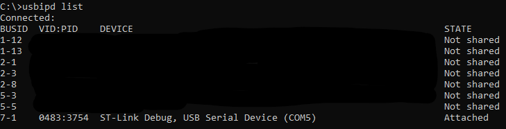

# Daisy Kardio

This repo contains code for experimenting with various DSP algorithms on the Daisy seed MCU.

## Installation

Docker is used for building the project and the provided Dockerfile will handle installation of dependencies.

Clone the git repo and create a docker image with the included makefile:

```sh
make docker_create_image
```

Note when calling the below scripts there may be an issue using bash. Use cmd instead if this fails.
Build the example projects:
```sh
make build_examples
```

Build the kardio libs project:
```sh
make build_kardio
```

## ST-LINK
For programming and debugging through the docker image with a ST-LINK, the usbipd tool is required. 
This can be found here: https://github.com/dorssel/usbipd-win

First, use usbipd to find the hardware id of your ST-LINK:
```sh
usbipd list
```


The hardware id is in this case 0483:3754.
This ST-LINK must be attached to wsl through the following command:
```sh
usbipd attach --wsl --hardware-id=0483:3754
```

Afterwards when running commands in the docker image, the usb device must be attached by passing the --device parameter: 
```sh
--device=/dev/bus/usb:/dev/bus/usb
```